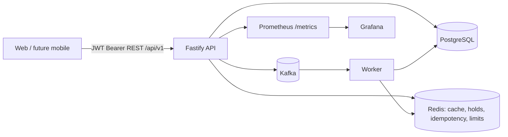

# CamerMove architecture

CamerMove is a stateless, versioned REST platform for six mobility and travel services. The interurban transport journey is the hero flow; complementary services remain independently deployable modules behind the same account and checkout primitives.

## Repository boundaries

- `apps/web`: Next.js UI. It calls REST only; it does not access Prisma.
- `apps/api`: Fastify `/api/v1`, Zod validation, auth/RBAC, metadata, idempotency, rate limits, repositories/services, OpenAPI.
- `apps/worker`: Kafka consumers and BullMQ delayed jobs (hold expiry and reminders).
- `packages/db`: Prisma schema and the single database access layer.
- `packages/shared`: money, commission, pagination and domain contracts.
- `packages/config`: validated environment configuration.
- `packages/events`: Kafka event contracts and publisher.
- `packages/observability`: metrics and tracing helpers.

## Runtime data flow

## Non-negotiable invariants

1. API requests carry auth; no server session or sticky state.
2. Mutating requests carry `Idempotency-Key`; replay returns the stored status/body.
3. Seat writes execute in Prisma transactions with row locks and database triggers.
4. Business logic lives in API/packages; web never imports the database.
5. User-visible periodic lists support date ranges and export formats.
6. Endpoint logs include `req.meta` and domain-specific fields; write actions are auditable.

## Service module map

| Service | Public flow | Durable output |
|---|---|---|
| Interurban | search → compare → seat → passenger → pay → ticket | booking, payment, e-ticket, `booking.created` |
| Hotels | search → availability → reserve → pay → confirm | accommodation booking |
| Rentals | catalogue → availability → duration → pay → confirm | rental booking |
| Parcels | create → quote → pay → track | tracking FSM and status history |
| Insurance | destination/dates → coverage → subscribe → pay | policy and attestation |
| Events | catalogue → category/quantity → pay | digital ticket and QR code |
