# CamerMove workflows

## Use case diagram

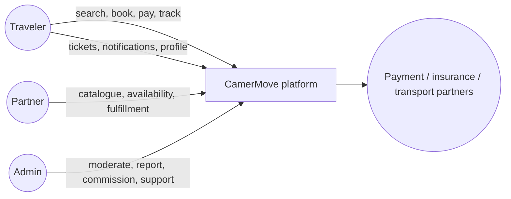

## Interurban booking sequence

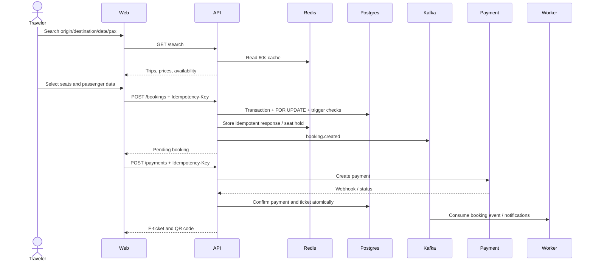

## Parcel activity diagram

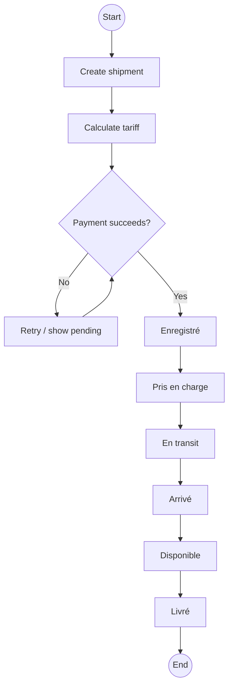

## Insurance activity diagram

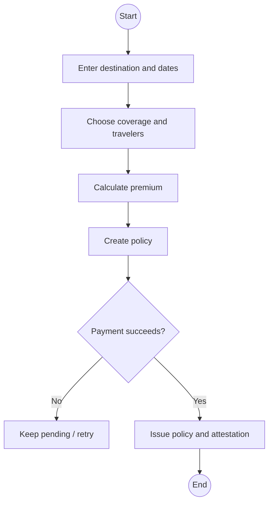

## Events purchase sequence

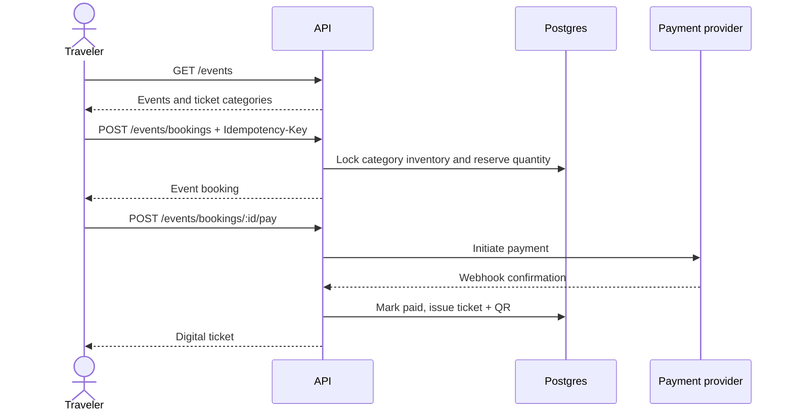

## Auth and observability flow

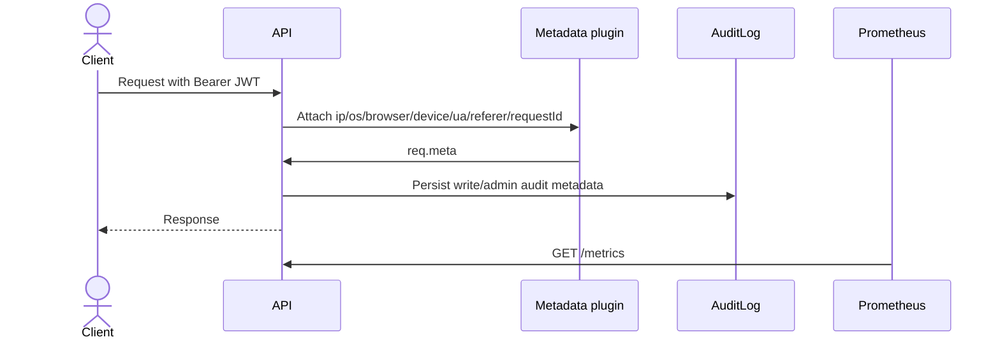

## City-first place search sequence

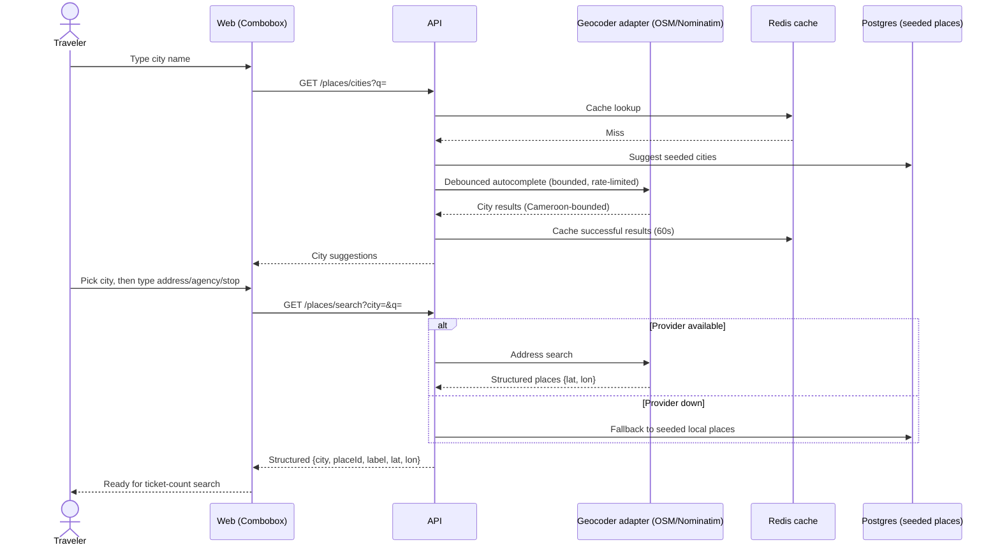

## Auth login / password reset activity

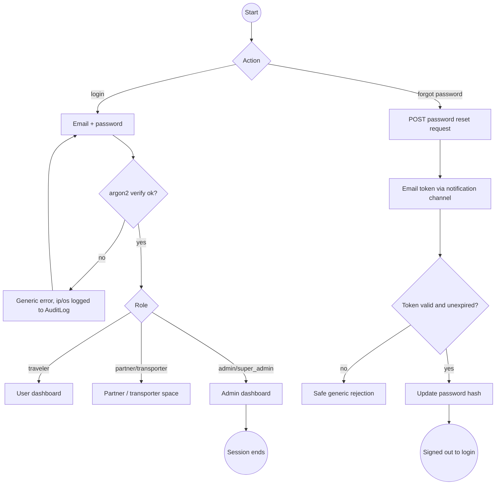

## Newsletter subscription activity

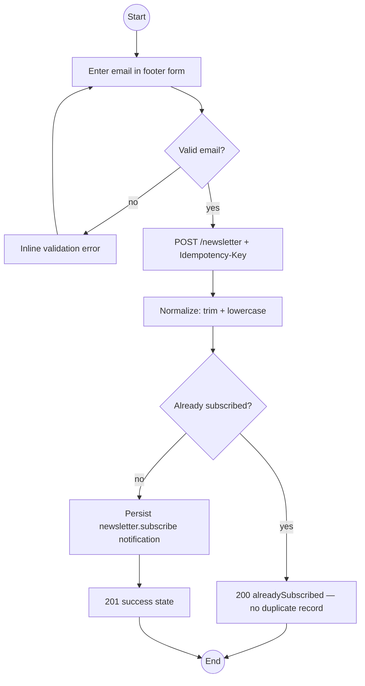

## PWA offline / cache activity

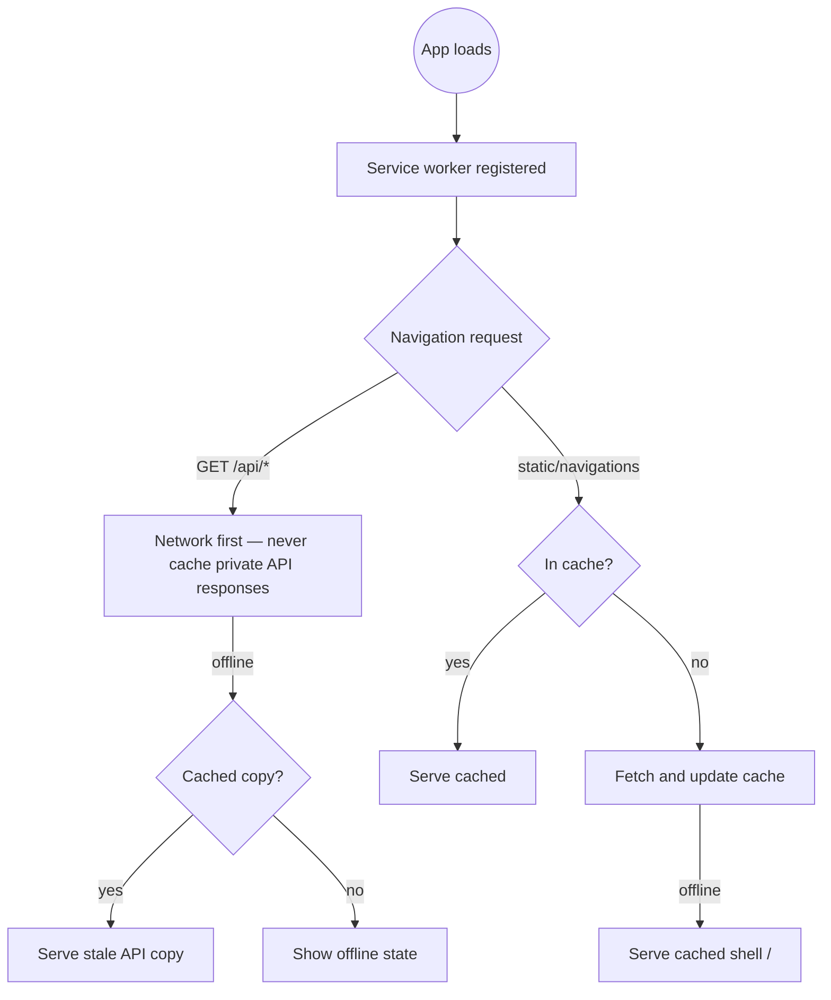

## Kafka / Prometheus / Grafana data flow

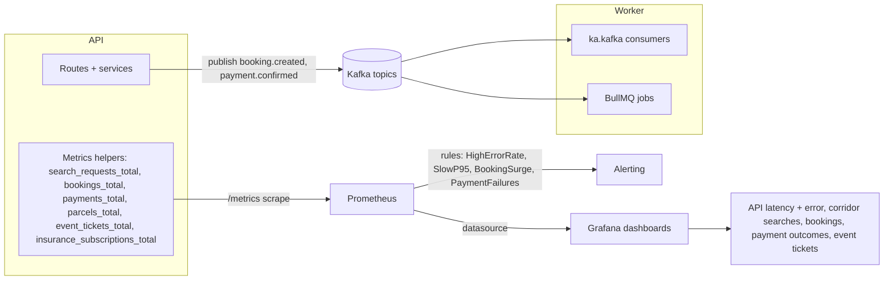

## ER overview (core entities)

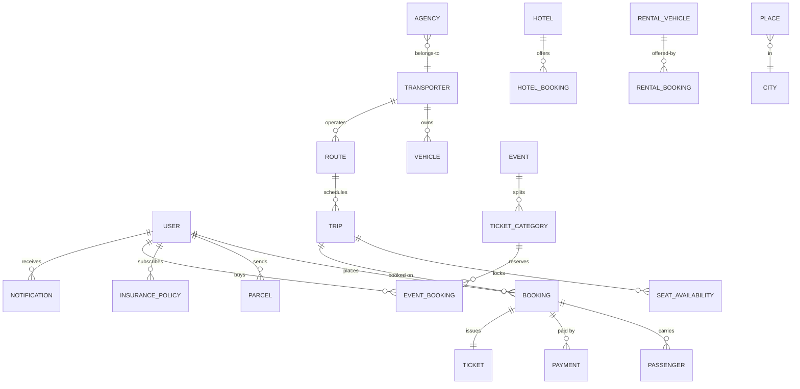
